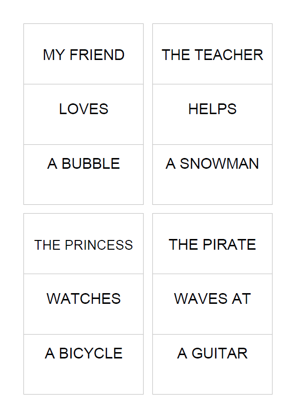

# Flip-n-Giggle Generator 🎪

A fun tool for creating interactive flip books for kids! Available as both a web app and a Python command-line tool.

## 🌐 Web Application (NEW!)

An interactive Vue.js website that generates flip-n-giggle books directly in your browser!

### Features

- 📱 **Mobile-first responsive design** - works on phones, tablets, and desktops
- 🎨 **Browser-based PDF generation** - no server-side processing needed
- 🌍 **Multilingual UI** - interface automatically adapts to your system language (English, German, Russian)
- 📚 **Multi-language presets** - English, German, and Russian phrases included
- ⚙️ **User-friendly interface** - essential settings up front, advanced options hidden
- 📥 **Instant download** - generate and download PDFs in seconds

### Quick Start

1. **Install dependencies for both frontend and server:**
```bash
cd frontend && npm install
cd ../server && npm install
```

2. **Configure the API connection (for production):**
```bash
cd frontend
cp .env.example .env
```
Edit `.env` and set `VITE_API_BASE_URL` to your server domain:
```bash
# For production with a separate server domain:
VITE_API_BASE_URL=https://your-server-domain.com

# For local development, leave empty (uses Vite's proxy):
VITE_API_BASE_URL=
```

3. **Start the API server:**
```bash
cd server
npm start
```

4. **Start the development server (in a separate terminal):**
```bash
cd frontend
npm run dev
```

5. **Open your browser:**
Navigate to `http://localhost:3000`

### Building for Production

```bash
cd frontend
npm run build
npm run preview
```

The built files will be in the `frontend/dist/` directory.

### Configuration

The frontend can be configured to connect to a separate server domain:

1. Copy the example environment file:
   ```bash
   cd frontend
   cp .env.example .env
   ```

2. Edit `.env` and set the server URL:
   ```bash
   VITE_API_BASE_URL=https://your-server-domain.com
   ```

3. Build the frontend:
   ```bash
   npm run build
   ```

**Note:** For local development, you can leave `VITE_API_BASE_URL` empty to use Vite's built-in proxy configuration.

### How to Use the Web App

1. **Configure your book:**
   - Choose page size (A4 or Letter)
   - Select phrases per page (1, 2, or 4)
   - Choose cut guide style
   - Expand "Advanced Settings" for more options

2. **Add phrases:**
   - Click preset buttons to load pre-saved phrases
   - Or type your own phrases in format: `A / B / C`
   - Each phrase becomes three flippable parts

3. **Generate:**
   - Click "Generate PDF" button
   - Your flip book downloads automatically!

### Web Technology Stack

- **Frontend:** Vue 3 + Vite
- **PDF Generation:** jsPDF
- **Backend API:** Express.js (serves phrase presets)
- **Styling:** Vanilla CSS with responsive design

---

## 🐍 Python CLI Tool

A standalone Python script that builds printable cut-book PDFs. Each phrase is split into three strips (A / B / C) so you can cut and flip them independently.

### Features

- 1, 2, or 4 phrases per page
- Big, centered text with per-line sizing
- Optional cut guides (internal, box, or both)
- Case control: normal, upper, lower, sentence
- Windows-friendly font auto-detection (C:\\Windows\\Fonts)

### Installation

```bash
pip install -r requirements.txt
```

### Usage

Prepare a text file with phrases in one of these formats:

- One phrase per line, delimited: `A / B / C` (also `|` or `;`)
- Blocks of 3 lines separated by a blank line

Then run:

```bash
python make_cutbook_pdf.py --input phrases.txt --output output.pdf
```

Examples page:


UPPER case, maximal font size of 30 points, 4 phrases per page with all lines around the phrases/terms:

```bash
python make_cutbook_pdf.py --input .\phrases\phrases_en.txt --output output_en.pdf --case upper --max-font 30 --phrases-per-page 4 --cut-guides all
```
Example page:



Change text case:

```bash
python make_cutbook_pdf.py --input phrases.txt --output output.pdf --case upper
```

If Cyrillic does not render, specify a font file:

```bash
python make_cutbook_pdf.py --input phrases.txt --output output.pdf --font-file "C:\\Windows\\Fonts\\arial.ttf"
```

## Arguments

- `--input` Input text file with phrases (default: `phrases.txt`)
- `--output` Output PDF path (default: `cutbook.pdf`)
- `--encoding` Input file encoding (default: `utf-8-sig`)
- `--pagesize` Page size: `A4` or `LETTER` (default: `A4`)
- `--font-file` Path to a TTF font file (optional)
- `--font-name` Internal font name when registering a TTF (default: `CutBookFont`)
- `--max-font` Max font size in points (default: `110`)
- `--min-font` Min font size in points (default: `26`)
- `--margin` Outer page margin in points (default: `48`)
- `--padding` Inner padding inside each phrase box in points (default: `18`)
- `--leading-mult` Line spacing multiplier (default: `2.15`)
- `--extra-gap` Extra points added to line spacing (default: `10.0`)
- `--phrases-per-page` Phrases per page: `1`, `2`, or `4` (default: `1`)
- `--gutter` Gap between phrase boxes in points (default: `18.0`)
- `--cut-guides` Guide lines: `none`, `internal`, `box`, `all` (default: `internal`)
- `--case` Text case: `none`, `upper`, `lower`, `sentence` (default: `none`)

## Example Phrase Files

The `phrases/` folder contains sample input files in `A / B / C` format:

- `phrases/phrases_en.txt`
- `phrases/phrases_ru.txt`
- `phrases/phrases_de.txt`

## Requirements

- Python 3.8 or higher
- reportlab


<a href="https://www.buymeacoffee.com/pylnik">
  
</a>
